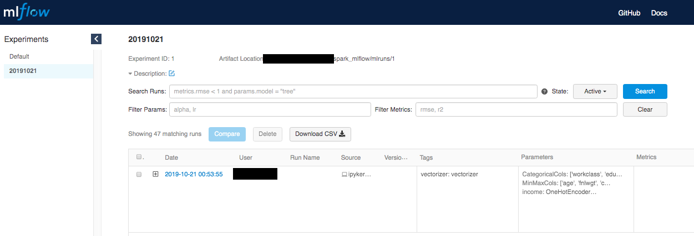
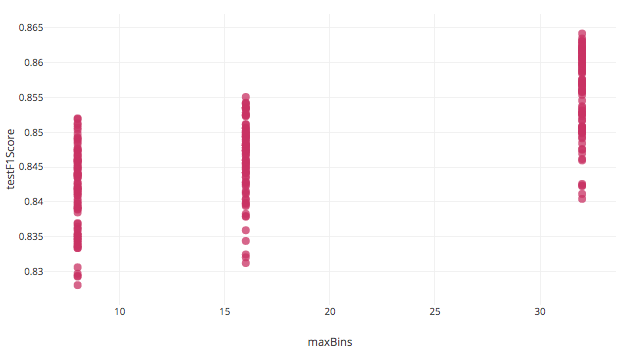
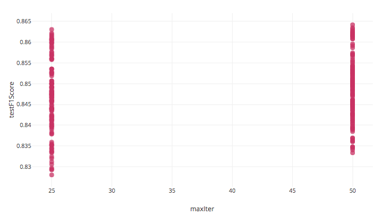
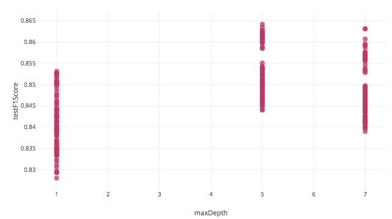
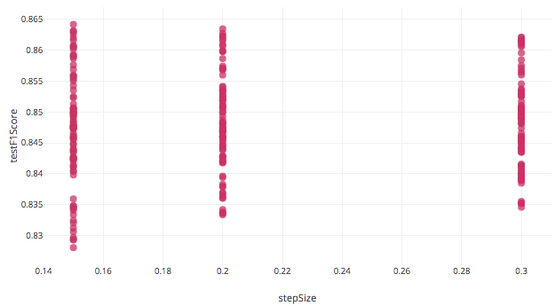
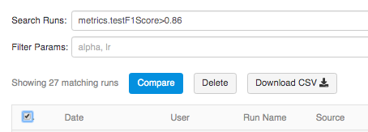
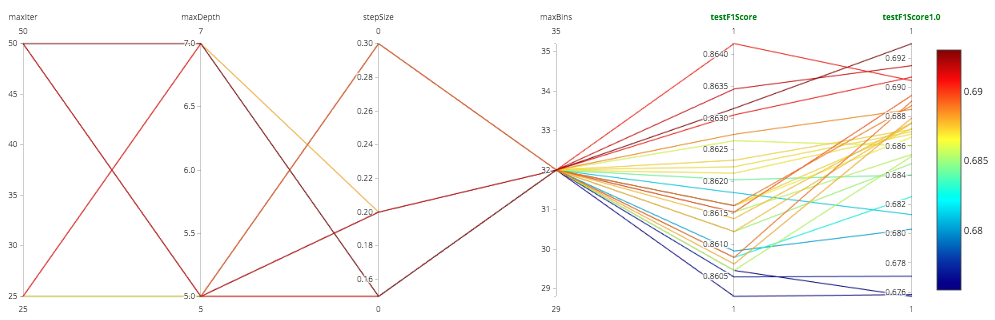
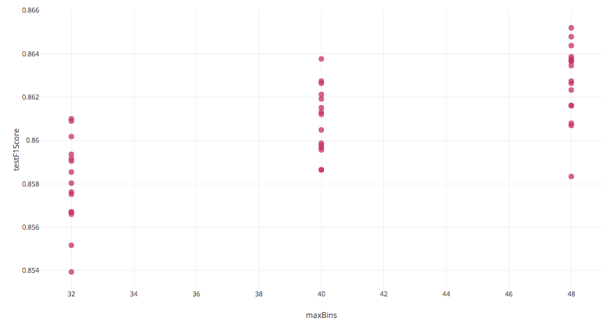
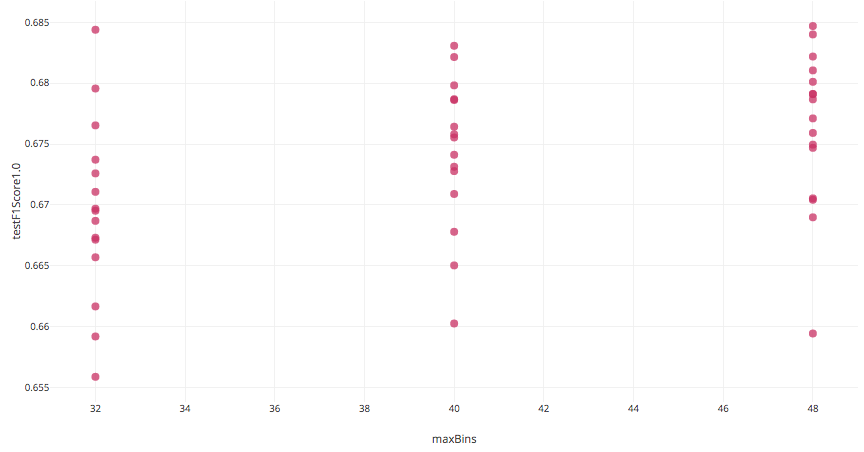
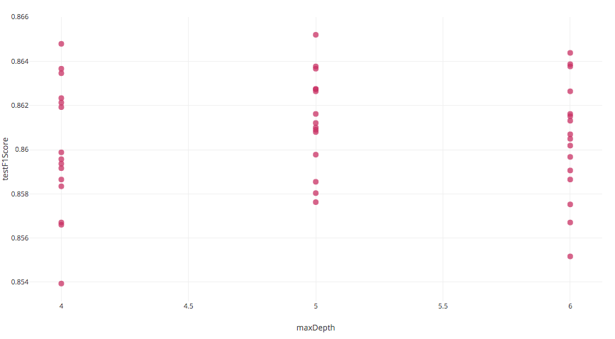

# Overview #

The purpose of this project is to create a complete example of how MLFlow can be used in an end to end Model Management setting. Databricks comes with MLFlow auto-tracking, which is partially replicated here for use outside of Databricks.

Basic EDA using custom spark describe + pandas_profiling:

1. Custom spark describe + EDA: [./source/data_exploration.py](./source/data_exploration.py)
2. Pandas-profiling report: [./reports/overview.html](./reports/overview.html)

Stratified TrainTestSplit in Spark (missing out of the box)

Demonstration of how to use MLFlow to:
1. Log nested runs with Spark MLlib vectorizers and CrossValidation / GridSearch outside of Databricks
2. Log nested runs with Genetic Algorithm for Hyperparameter Optimization instead of GridSearch (To be added)
2. Predict with a saved model via a script. (To be added)
3. Create a microservice API of the model: (To be added)
    - via terminal
    - dockerized service 

### Configure conda/miniconda ###

If you haven't already done so, add conda-forge as a channel
```
conda config --add channels conda-forge
conda config --set channel_priority false
```
Create the environment:
```
conda create --name spark_mlflow python=3.7 jupyter pandas-profiling pyspark pyarrow mlflow unittest
```

### Download the sample data: ###

```
python source/get_data.py 
```
## MLFlow UI ###

### To run ad-hoc, execute the following in the terminal within the folder of the project: ###
```
conda activate spark_mlflow
mlflow ui
```
### To start MLFlow UI in the background instead to run indefinitely: ###
_Assumes NodeJS and npm are installed_
http://pm2.keymetrics.io/docs/usage/quick-start/

1. Install PM2 (process manager)
    ```
    npm install pm2@latest -g
    # or 
    yarn global add pm2
    ```
2. Start mlflow:
    ```
    pm2 start mlflow.sh
    # check logs for succesfull initialization:
    pm2 logs mlflow.sh
    ```
    _mlflow.sh must have execution rights_
3. If you want MLFlow UI to start on every reboot:
    ```
    pm2 save
    pm2 startup
    ```

## Example ##

Using demographic data to predict if the income is above or below 50K

### Vectorization ###

```python
categorical_cols = [
    'workclass', 'education', 'education-num', 'marital-status', 'occupation',
    'relationship', 'race', 'sex', 'native-country'
]

scaling_cols = [
    'age', 'fnlwgt', 'capital-gain', 'capital-loss', 'hours-per-week'
]

#create vectorizer model and transform df
vectorizer, transformed_df = SparkMethods.vectorizer(
    df,
    labels_to_vectorize={'income': 'OneHotEncoderEstimator'},
    CategoricalCols=categorical_cols,
    MinMaxCols=scaling_cols)
transformed_df.show()
```


### Stratified train/test split ###

```python
# Split the data into training and test sets (30% held out for testing)
strata_cols = ['income', 'sex']
trainingData, testData = SparkMethods.train_test_split(
    transformed_df,
    strata_cols,
    trainRatio=0.7,
    show_summary=True)
```

|      strata|train_count|test_count|test_%|
|------------|-----------|----------|------|
| >50K,Female|        825|       354|   0.3|
|  <=50K,Male|      10589|      4539|   0.3|
|<=50K,Female|       6714|      2878|   0.3|
|   >50K,Male|       4663|      1999|   0.3|


## MLFlow with a GradientBoostedTrees Classifier Grid Seacrh (CrossValidator) ##

This grid search has 54 combinations tested on 5 folds. If you have a regular laptop, try using fewer hyperparameter options before visualizing which settings work best using the MLFlow UI to tweak and repeat.

```python
grid_params = {
    'maxDepth': [1,5,7],
    'maxBins': [8,16,32],
    'maxIter': [25,50],
    'stepSize': [0.15,0.2,0.3]
}

cv_model, train_df, test_df = SparkMethods.grid_search_GBT(
    trainingData,
    testData,
    evaluator='MulticlassClassificationEvaluator',
    label_col='label',
    features_col='features',
    kfolds=5,
    grid_params=grid_params)
```

### MLFlow to analyze best hyperparameters for further optimization ###

Selecting all runs and comparing the results we see that:

__maxBins:__ There is an upward trend in F1Score as we increase the number of bins.



__maxIter:__ Not much gain with twice as many iterations.



__maxDepth:__ depth of 5 performs better than 1 or 7. We could try 4,5,6 next.



__stepSize:__ The smaller stepSize of 0.15 yielded some models with better results and with greater variability in results.



Filtering to see testF1Scores > 0.86 and consistent with the above, we can conclude that maxBins of 8 and 16 don't need to be attempted again and maxDepth of 1 can be ignored as well. Adding more bins would help since the best scores were all with the most bins.





### Adjust the parameters based on the above findings and run another experiment: ###

```python
grid_params = {
    'maxDepth': [4,5,6],
    'maxBins': [32,40,48],
    'maxIter': [25],
    'stepSize': [0.15]
}

cv_model, train_df, test_df = SparkMethods.grid_search_GBT(
    trainingData,
    testData,
    evaluator='MulticlassClassificationEvaluator',
    label_col='label',
    features_col='features',
    kfolds=5,
    grid_params=grid_params)
```

### Selecting the new runs we see that: ###

__maxBins:__ Continues to improve slightly with more bins but is not getting past 70% F1Score of 1.0. Other algorithms should be tested and potentially ensembled.





__maxDepth:__ Depth of 5 is optimal.

